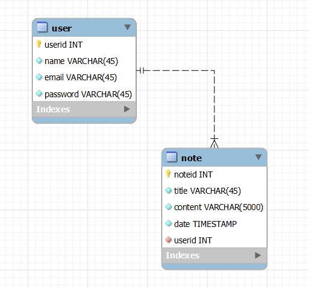
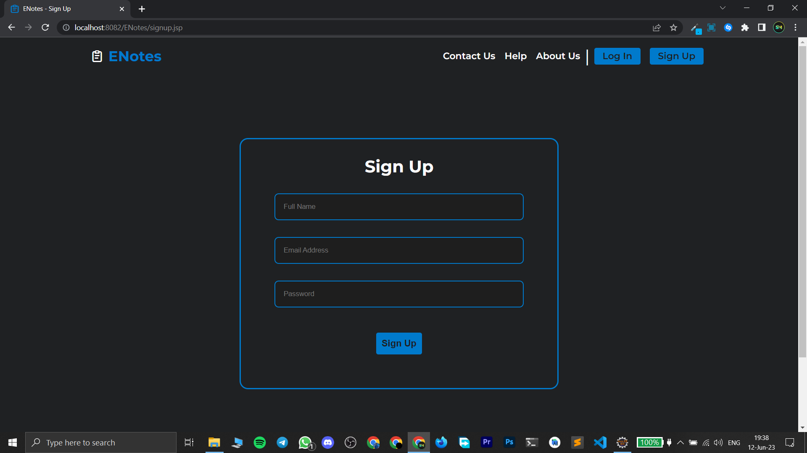
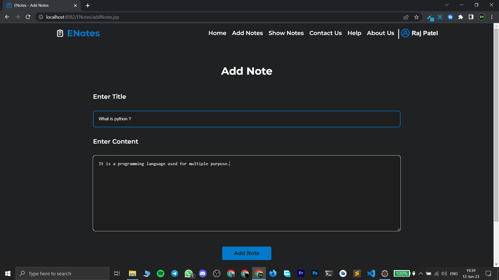
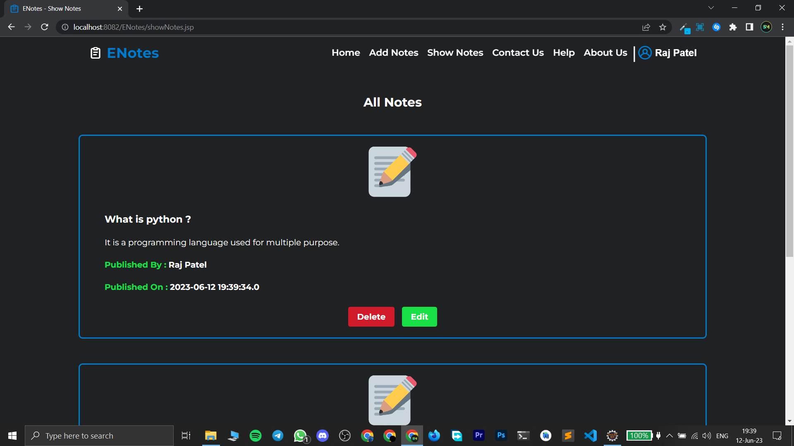

# ENotes

#### This is a full stack Java based webapp for taking and storing notes online.

## Functionalities

- User can Signup and Login to the app.

- User can add notes in their account.

- User can see the notes stored in their account.

- It is completely responsive, user can use it from any device.

- The notes are synced in real time on all the devices, you just need to refresh the page.

## Database Schema

## Tech Stack

- [JSP (Java Server Pages)](https://docs.oracle.com/javaee/5/tutorial/doc/bnagx.html) for creating the structure of the webapp and server side rendering.

- `Custom CSS` for styling the webapp and making it responsive.

- [JDBC (Java Database Connectivity) API](https://docs.oracle.com/javase/8/docs/technotes/guides/jdbc/) for interacting with MySQL databse.

- [Servlet](https://docs.oracle.com/javaee/7/api/javax/servlet/Servlet.html) for processing incoming get/post request from the user and forwarding the user to suitable JSP page after processing the request.

- [Java](https://docs.oracle.com/en/java/) for implementing the logic.

- [MySQL Database](https://www.mysql.com/) for storing user details as well as their notes.

- [Tomcat Server](https://tomcat.apache.org/) for hosting and running the project locally.

## Video Demo

Click on this thumbnail to watch the video.

## ScreenShots

 

